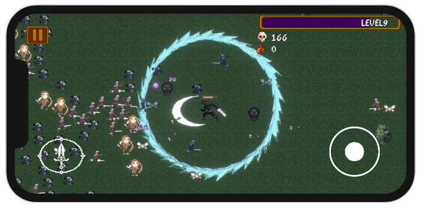

# Villain's Valour

**Villain's Valour** is a 2D action survival game where the player fights waves of enemies, collects upgrades, earns coins and tries to survive as long as possible. The game features player progression, weapons, upgrades, enemy spawning, UI systems and leaderboard support.



## About the Game

In Villain's Valour, the player must survive against incoming enemies while improving their stats and unlocking stronger upgrades. The game is built with Unity and focuses on fast-paced combat, simple controls and replayable progression.

##  Features

- 2D player movement
- Enemy spawning system
- Weapon attack system
- Player health and damage upgrades
- Coin collection
- Shop upgrade system
- Persistent player data using `PlayerPrefs`
- Leaderboard integration
- Mobile/WebGL friendly controls
- Game over and restart flow
- UI for health, coins, upgrades and score

## Built With

- Unity
- C#
- TextMeshPro
- LootLocker Leaderboards
- WebGL / mobile build support

## Project Structure

```txt
Villains-Valour/
│
├── Assets/
│   ├── Scripts/
│   ├── Sprites/
│   ├── Prefabs/
│   ├── Scenes/
│   ├── UI/
│   └── Animations/
│
├── ProjectSettings/
├── Packages/
└── README.md
